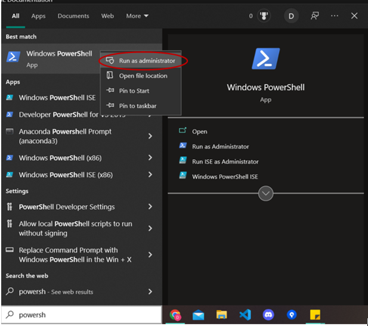
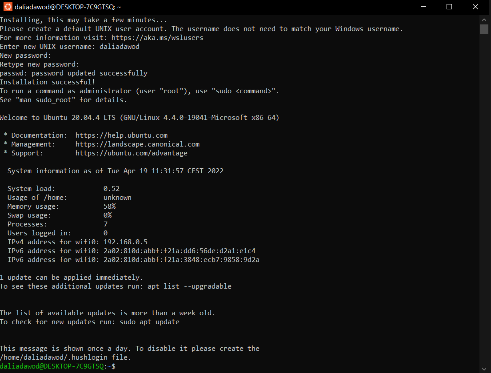
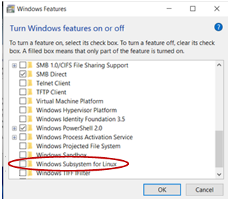

## How to install windows subsystem for Linux!

We recommend using the ' wsl --install ' to install Windows Subsystem for Linux for simplicity, it allows the user to run linux commands on windwos. However, if you're running an older build of Windows, that may not be supported.

## Step 1 - Enable the Windows Subsystem for Linux

You must first enable the "Windows Subsystem for Linux" optional feature on windows.

Open PowerShell as Administrator (Start menu > PowerShell > right-click > Run as Administrator)



and enter this command:

```sh
dism.exe /online /enable-feature /featurename:Microsoft-Windows-Subsystem-Linux /all /norestart
```


## Step 2 - Install your Linux distribution of choice

- Open the Microsoft Store
- select your favorite Linux distribution.
- From the distribution's page, select "Get".


Note: The first time you launch a newly installed Linux distribution, a console window will open and you'll be asked to wait for a minute or two for files to de-compress and be stored on your PC. All future launches should take less than a second.

## Step 3 - You will need to create a user account and password for your new Linux distribution.


- This User Name and Password is specific to each separate Linux distribution that you install and has no bearing on your Windows user name.

- Once you create a User Name and Password, the account will be your default user for the distribution and automatically sign-in on launch.

- This account will be considered the Linux administrator, with the ability to run sudo (Super User Do) administrative commands.

- Each Linux distribution running on WSL has its own Linux user accounts and passwords. You will have to configure a Linux user account every time you add a distribution, reinstall, or reset.



Congratulations! You've successfully installed and set up a Linux distribution that is com pletely integrated with your Windows operating system!

## To change or reset your password:

Open the Linux distribution and enter the command:

```sh
passwd
```

You will be asked to enter your current password, then asked to enter your new password, and then to confirm your new password.

If you forgot the password for your Linux distribution:

- Open PowerShell and enter the root of your default WSL distribution using the command:

  ```sh
  wsl -u root
  ```

- If you need to update the forgotten password on a distribution that is not your default, use the command:

  ```sh
  wsl -d Debian -u root
  ```

  replacing Debian with the name of your targeted distribution.

- Once your WSL distribution has been opened at the root level inside PowerShell, you can use this command to update your password:

  ```sh
  passwd <username>
  ```

  where <username> is the username of the account in the distribution whose password you've forgotten.

- You will be prompted to enter a new UNIX password and then confirm that password. Once you're told that the password has updated successfully, close WSL inside of PowerShell using the command:
  ```sh
  exit.
  ```

## Troubleshooting Installation

For "WslRegisterDistribution failed with error: 0x8007019e" as in:


1. Open Run by holding the Windows and R keys together.

2. Type optionalfeatures.exe to launch Windows Features.

   

3. Look for Windows Subsystem for Linux and enable it by checking the box next to it.

4. Click on OK. Windows Features searches for the required files and applies the changes.

   

5. When prompted, click on Restart now to restart your PC. Now see if the error is fixed.

   

6. In case the option was already checked in Step 3, then uncheck to disable the Linux subsystem. Reboot your system.

7. On rebooting, go back to Windows features and enable the option again. Restart your computer again.

8. Check if you are able to open the Linux terminal without any errors.

## Additional Resources and References

- [Microsoft docs - Manual installation steps for older versions of WSL ](https://docs.microsoft.com/en-us/windows/wsl/install-manual#step-6---install-your-linux-distribution-of-choice)

- [Microsoft docs - Set up a WSL development environment](https://docs.microsoft.com/en-us/windows/wsl/setup/environment#set-up-your-linux-username-and-password)
